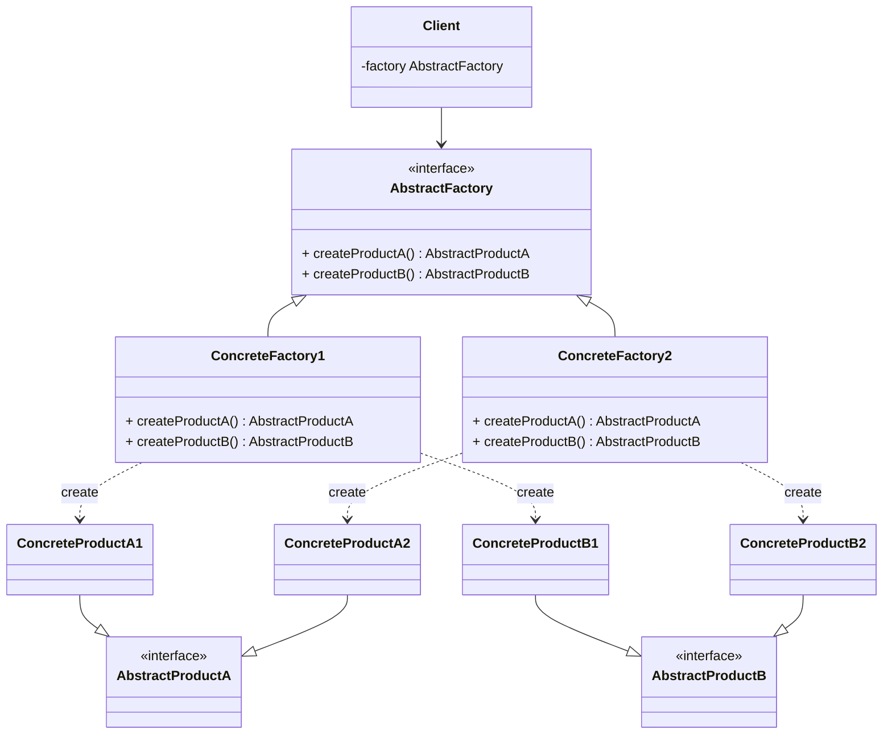
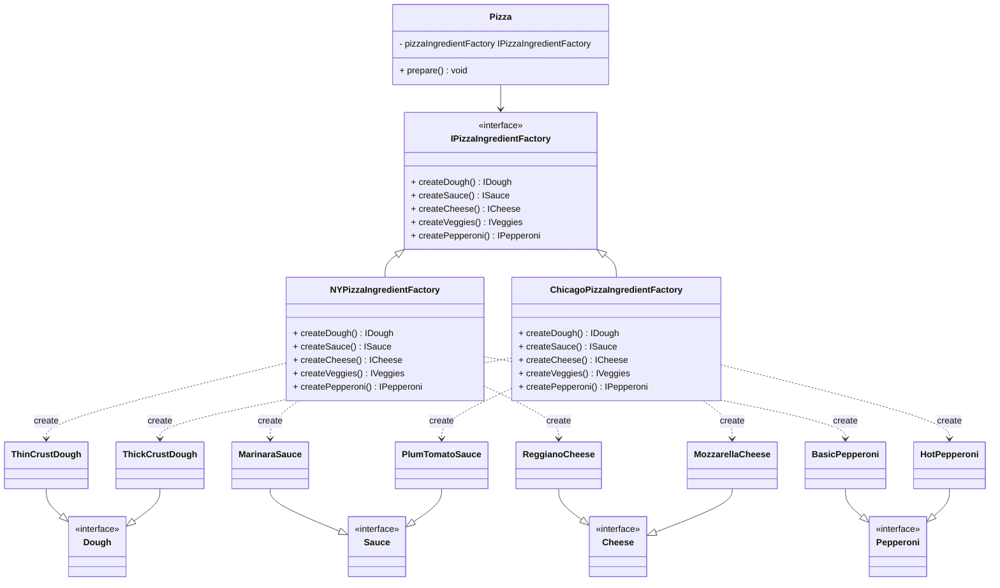

# Abstract factory pattern

## Definition

```text
The Abstract factory pattern provides an interface for creating families of related or dependent objects without specifying their concrete classes.
```

## Diagram UML


* `Abstract Products` declare interfaces for a set of distinct but related products which make up a product family.
* `Concrete Products `are various implementations of abstract products, grouped by variants. Each abstract product must be implemented in all given variants.
* The `Abstract Factory` interface declares a set of methods for creating each of the abstract products.
* `Concrete Factories` implement creation methods of the `abstract factory`. Each `concrete factory` corresponds to a specific variant of `products` and creates only those `product` variants.
* Although `concrete factories` instantiate `concrete products`, signatures of their creation methods must return corresponding `abstract products`. This way the `client` code that uses a `factory` doesn’t get coupled to the specific variant of the `product` it gets from a `factory`. The `Client` can work with any `concrete factory/product` variant, as long as it communicates with their objects via abstract interfaces.

## Pizza store example



To simplifies the diagram we don't represent the veggies

In this example :
* `Pizza` is the `Client`.
* `IPizzaIngredientFactory` is the `AbstractFactory`.
* `NYPizzaIngredientFactory` and `ChicagoPizzaIngredientFactory` are the `concrete factories`.
* `Dough`, `Sauce`, `Cheese` and `Pepperoni` pizzas are the `concrete products`.
* `ThinCrustDough`, `ThickCrustDough`, `MarinaraSauce`, `PlumTomatoSauce`, `ReggianoCheese`, `MozzarellaCheese`, `BasicPepperoni` and `HotPepperoni` are the `concrete products`.

We have each `products` (dough/sauce/cheese/pepperoni) are well implemented in the different variant (NY style/ chicago style).

| Product\Variant | NY Style       | Chicago Style    |
|-----------------|----------------|------------------|
| Dough           | ThinCrustDough | ThickCrustDough  |
| Sauce           | MarinaraSauce  | PlumTomatoSauce  |
| Cheese          | ReggianoCheese | MozzarellaCheese |
| Pepperoni       | BasicPepperoni | HotPepperoni     |


* For a given style/variant, the associated factory creates the needed variants (that are associate to the concrete factory)


## Pros
* You can be sure that the products you’re getting from a factory are compatible with each other.
* You avoid tight coupling between concrete products and client code.
* Single Responsibility Principle. You can extract the product creation code into one place, making the code easier to support.
*  Open/Closed Principle. You can introduce new variants of products without breaking existing client code.

## Cons
*  The code may become more complicated than it should be, since a lot of new interfaces and classes are introduced along with the pattern.