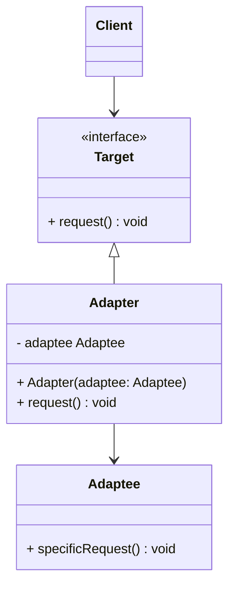
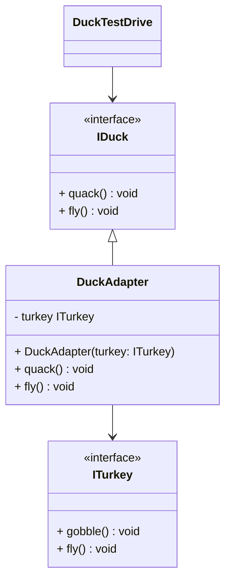

# Adapter pattern

## Definition

```text
The adapter pattern converts the interface of a class into another interface the clients expect.
Adapter lets classes work together that couldn't otherwise because of incompatible interfaces.
```

## Diagram UML


* The `Client` is a class that contains the existing business logic of the program. 
It only see the `Target` interface.
* The `Target` interface describes a protocol that other classes must follow 
to be able to collaborate with the `client` code.
* The `Adaptee` is some useful class (usually 3rd-party or legacy). 
The `Client` can’t use this class directly because it has an incompatible interface.
* The `Adapter` is a class that’s able to work with both the `Client` and the `Adaptee`:
it implements the `Target` interface, while wrapping the `Adaptee` object. 
The `Adapter` receives calls from the `Client` via the `Target` interface and translates 
them into calls to the wrapped `Adaptee` object in a format it can understand.
* The `Client` code doesn’t get coupled to the concrete `Adapter` class as long as it works with the `Adapter`
via the `Target` interface. Thanks to this, you can introduce new types of `Adapters` into the program without breaking 
the existing `Client` code. This can be useful when the interface of the `Adaptee` class gets changed or replaced:
you can just create a new `Adapter` class without changing the `Client` code.

## Duck example



In this example, we want tu use a `Turkey` object as a `Duck` object, to do so we create a `DuckAdapter`.
* `DuckTestDrive` is the `Client` that used the `DuckAdapter`.
* `IDuck` is the `Target` interface.
* `DuckAdapter` is the `Adapter`.
* `ITurkey` is the `Adaptee`.

## Pros

* Single Responsibility Principle. You can separate the interface or data conversion code 
from the primary business logic of the program.
* Open/Closed Principle. You can introduce new types of adapters 
into the program without breaking the existing client code, 
as long as they work with the adapters through the client interface.

## Cons

* The overall complexity of the code increases because you need to introduce
a set of new interfaces and classes. Sometimes it’s simpler just to change 
the `Adaptee` class so that it matches the rest of your code. (But it's not always possible)