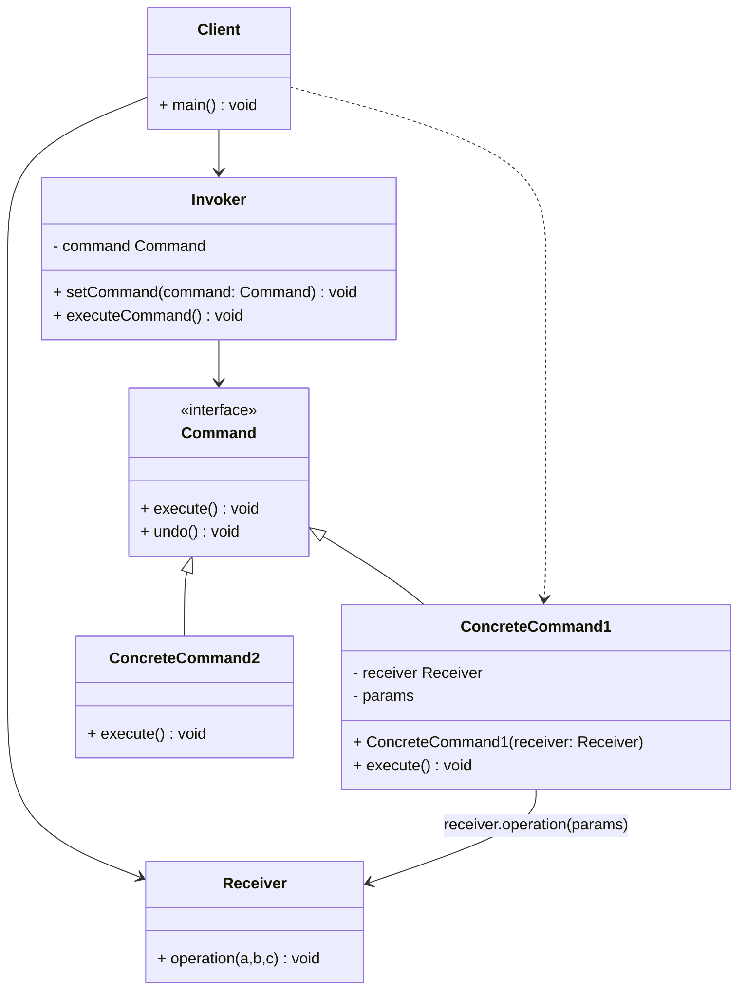
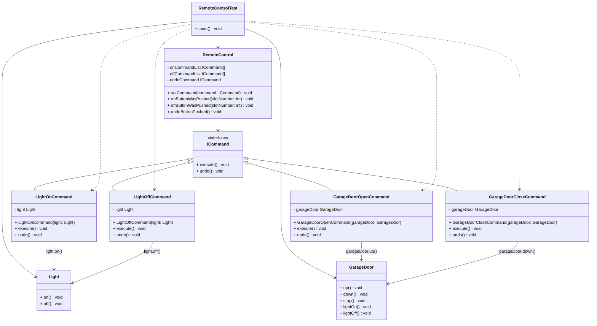

# Command Pattern

## Definition

```text
The command pattern encapsulates a request as an object,
thereby letting you parameterize other objects with different requests, queue or log request,
and support undoable operations.
```

## Diagram UML



* The `Invoker` is responsible for initiating requests. 
This class must have a field for storing a reference to a command object. 
The `Invoker` triggers that command instead of sending the request directly to the `Receiver`.
Note that the `Invoker` isn’t responsible for creating the `Command` object. 
Usually, it gets a pre-created `Command` from the `Client` via the constructor.
* The `Command` interface usually declares just a single method for executing the command and one to undo the command.
* `Concrete Commands` implement various kinds of requests.
A `Concrete Command` isn’t supposed to perform the work on its own, but rather to pass the call to one of the business logic objects. 
However, for the sake of simplifying the code, these classes can be merged.
Parameters required to execute a method on a receiving object can be declared as fields in the `concrete command`.
You can make `command objects` immutable by only allowing the initialization of these fields via the constructor.
* The `Receiver` class contains some business logic. 
Almost any object may act as a receiver. 
Most commands only handle the details of how a request is passed to the `Receiver`, while the `Receiver` itself does the actual work.
* The `Client` creates and configures `Concrete Command` objects. 
The `Client` must pass all of the request parameters, including a `Receiver` instance, into the `Command`’s constructor. 
After that, the resulting `Command` may be associated with one or multiple `Invoker`.

## Remote Control example



To keep the explanation simple, I will only explain the diagram with this tow objects (you can find the complete diagram below)
 In this example :
* `RemoteControlTest` is the `Client`, he is the one that configure the `remoteControl` and call the methods when a button is pushed.
* `RemoteControl` is the `Invoker`, he is one containing the command (set by th `RemoteControlTest`) 
and he is the one calling the `execute()` and `undo()` of the `Concrete Commands`.
* `Light` and `GarageDoor` are the `Recevier`, they contain the logic associated to their purpose.
They are the one containing the logic about how they work: the light has the methods to be turn on or off, 
and the garage door to go up and down.
* `LightOnCommand`, `LightOffCommand`, `GarageDoorOpenCommand` and `GarageDoorCloseCommand` are the `Concrete Command`.
They encapsulate a specific request (in their `execute()`method) and how to undo it (in their `undo` method).

## Pros
* Single Responsibility Principle. You can decouple classes that invoke operations from classes that perform these operations.
* Open/Closed Principle. You can introduce new commands into the app without breaking existing client code.
* You can implement undo/redo.
* You can implement deferred execution of operations.
* You can assemble a set of simple commands into a complex one.

## Cons
*  The code may become more complicated since you’re introducing a whole new layer between senders and receivers.

## Complete diagram of the remote control example

```mermaid
classDiagram
    class RemoteControlTest {
        + main() void
    }

    class RemoteControl {
        - onCommandList ICommand[]
        - offCommandList ICommand[]
        - undoCommand ICommand
        + setCommand(command: ICommand) void
        + onButtonWasPushed(slotNumber: int) void
        + offButtonWasPushed(slotNumber: int) void
        + undoButtonPushed() void
    }
    
    class ICommand {
        + execute() void
        + undo() void
    }
    <<interface>> ICommand
    
    class Light {
        + on() void
        + off() void
    }

    class LightOnCommand {
        - light Light
        + LightOnCommand(light: Light)
        + execute() void
        + undo() void
    }

    class LightOffCommand {
        - light Light
        + LightOffCommand(light: Light)
        + execute() void
        + undo() void
    }

    class GarageDoor {
        + up() void
        + down() void
        + stop() void
        + lightOn() void
        + lightOff() void
    }

    class GarageDoorOpenCommand {
        - garageDoor GarageDoor
        + GarageDoorOpenCommand(garageDoor: GarageDoor)
        + execute() void
        + undo() void
    }

    class GarageDoorCloseCommand {
        - garageDoor GarageDoor
        + GarageDoorCloseCommand(garageDoor: GarageDoor)
        + execute() void
        + undo() void
    }

    class NoCommand {
        + execute() void
        + undo() void
    }
    
    class CeilingFanSpeed {
        OFF
        LOW
        MEDIUM
        HIGH
    }
    <<enumeration>> CeilingFanSpeed

    class CeilingFan {
        + off() void
        + low() void
        + medium() void
        + high() void
        + getSpeed() CeilinFanSpeed
    }

    class CeilingFanOnCommand {
        - ceilingFan CeilingFan
        + CeilingFanOnCommand(ceilingFan: CeilingFan)
        + execute() void
        + undo() void
    }

    class CeilingFanOffCommand {
        - ceilingFan CeilingFan
        - previousSpeed CeilinFanSpeed
        + CeilingFanOffCommand(ceilingFan: CeilingFan)
        + execute() void
        + undo() void
    }
    
    class StereoMode {
        STANDBY,
        CD,
        DVD,
        RADIO
    }
    <<enumeration>> StereoMode
    
    class Stereo {
        - volume int
        - currentMode StereoMode
        + on() void
        + off() void
        + setCd() void
        + setDvd() void
        + setVolume(volume: int) void
        + getVolume() int
        + getMode() StereoMode 
    }

    class StereoOnWithCDCommand {
        - stereo Stereo
        - previousMode StereoMode
        + StereoOnWithCDCommand(Stereo: stereo)
        + execute() void
        + undo() void
    }

    class StereoOffCommand {
        - stereo Stereo
        - previousMode StereoMode
        - previousVolume int
        + StereoOffCommand(Stereo: stereo)
        + execute() void
        + undo() void
    }
    
    class MacroCommand {
       - commandList ICommand[]
       + MacroCommand(commandList: ICommand[])
       + execute()
       + undo()
    }
    
    CeilingFan --> CeilingFanSpeed
    CeilingFanOffCommand --> CeilingFanSpeed
    
    Stereo --> StereoMode
    StereoOnWithCDCommand --> StereoMode
    StereoOffCommand --> StereoMode
    
    MacroCommand --> ICommand : 1..*

    ICommand <|-- LightOnCommand
    ICommand <|-- LightOffCommand

    ICommand <|-- GarageDoorOpenCommand
    ICommand <|-- GarageDoorCloseCommand

    ICommand <|-- NoCommand

    ICommand <|-- CeilingFanOnCommand
    ICommand <|-- CeilingFanOffCommand

    ICommand <|-- StereoOnWithCDCommand
    ICommand <|-- StereoOffCommand

    ICommand <|-- MacroCommand

    RemoteControl --> ICommand

    RemoteControlTest --> RemoteControl
    
    RemoteControlTest --> Light
    RemoteControlTest ..> LightOnCommand
    RemoteControlTest ..> LightOffCommand

    RemoteControlTest --> GarageDoor
    RemoteControlTest ..> GarageDoorOpenCommand
    RemoteControlTest ..> GarageDoorCloseCommand

    RemoteControlTest ..> NoCommand

    RemoteControlTest --> CeilingFan
    RemoteControlTest ..> CeilingFanOnCommand
    RemoteControlTest ..> CeilingFanOffCommand

    RemoteControlTest --> Stereo
    RemoteControlTest ..> StereoOnWithCDCommand
    RemoteControlTest ..> StereoOffCommand

    RemoteControlTest ..> MacroCommand

    LightOnCommand --> Light : light.on()
    LightOffCommand --> Light : light.off()

    GarageDoorOpenCommand --> GarageDoor : garageDoor.up()
    GarageDoorCloseCommand --> GarageDoor : garageDoor.down()
    
    CeilingFanOnCommand --> CeilingFan
    CeilingFanOffCommand --> CeilingFan
    
    StereoOnWithCDCommand --> Stereo
    StereoOffCommand --> Stereo
```


