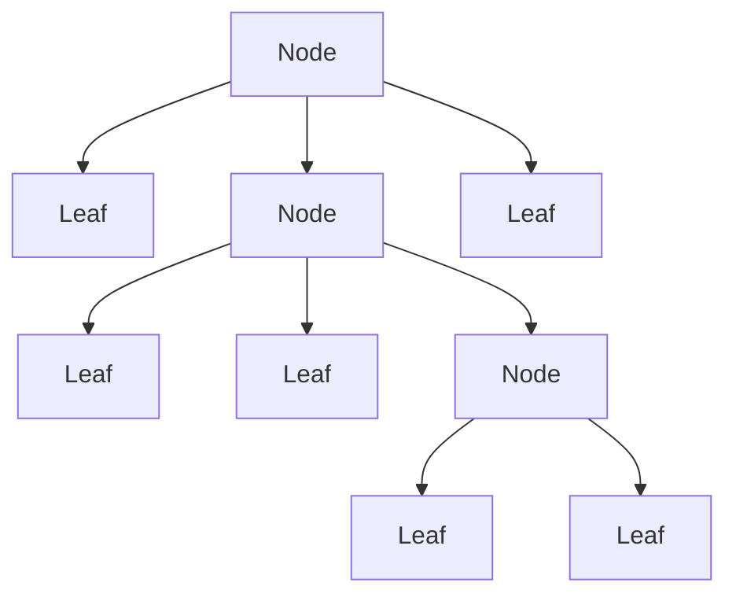
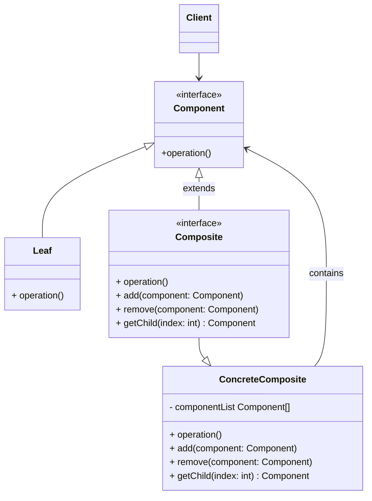
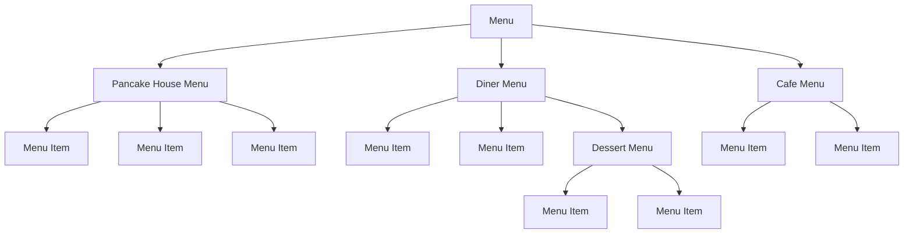
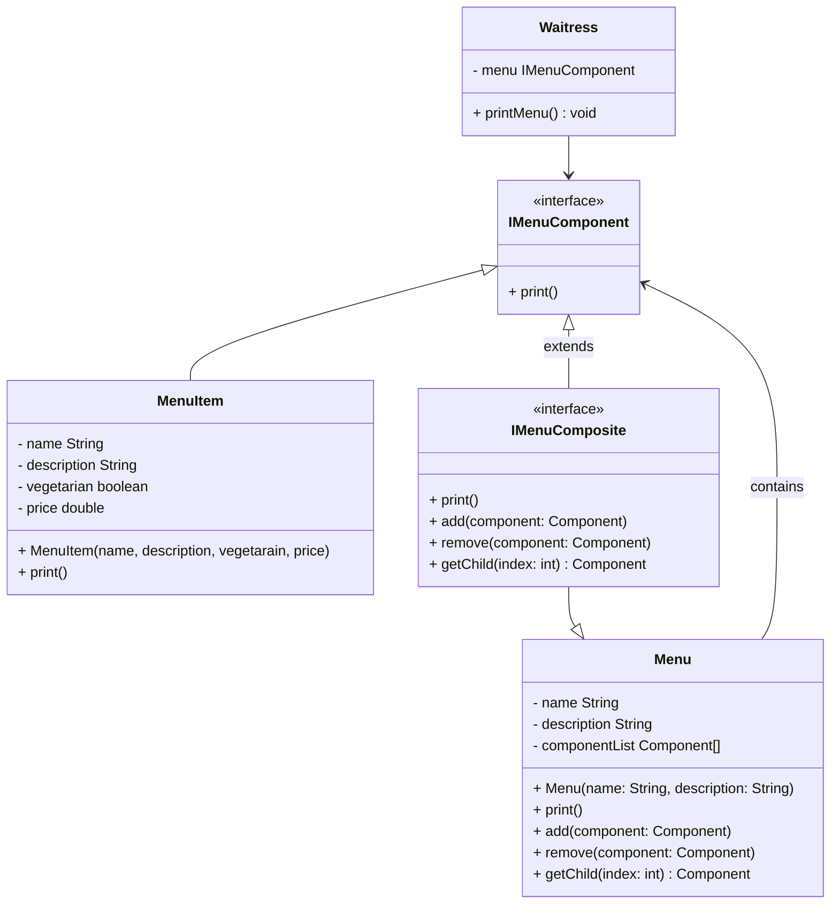

# Composite pattern

## Definition

```text
The composite pattern allows you to compose objects into tree structures to represent part-whole hierarchies.
Composite lets clients treat individual objects and compositions object uniformly.
```

## Diagram



In this diagram:
* `Leaf` represents the individual objects that do not have any child objects.
* `Node` represents objects that can contain other objects, including both leaves and other nodes.

## Diagram UML



* The `Component` interface describes operations 
  that are common to both simple and complex elements of the tree. (`Leaf` and `Composite`).
* The `Leaf` is a basic element of a tree that doesn’t have sub-elements.
  Usually, `leaf` components end up doing most of the real work, since they don’t have anyone to delegate the work to.
* The `Composite` interface defines all the methods common to the composite elements : add, remove and get an element.
* The `ConcreteComposite` is an element that has sub-elements: leaves or other `composite`. 
  It doesn’t know the concrete classes of its children. It works with all sub-elements only via the `component` interface.
  Upon receiving a request, a `composite` delegates the work to its sub-elements, 
  processes intermediate results and then returns the final result to the client.
* The `Client` works with all elements through the `component` interface.
  As a result, the client can work in the same way with both simple or complex elements of the tree.

## Objectville restaurant example

We want to manage a menu in a restaurant composed of several menu and menu items.





In this example :
* `Waitress` is the `Client`. It only uses a `IMenuComponent` and doesn't know if it's a composite or a leaf object. 
* `IMenuComponent` is the `Component` interface.
  The operation common to each Component is the `print()` methods that is common to all component : leaf like composite.
* `MenuItem` are the only leaf items in our case. They are the know that will print the information about a menu item.
* `IMenuComposite` is the `Composite` interface, it extends the `IMenuComponent` interface 
  and define the methods to add, remove and get a child.
* The `Menu` is the only `ConcreteComposite` in our example.
  When calling the print() method it will display it's name and description 
  then it will iterate over its children to asked them to print their own information. 
  The menu delegates the display of its children to its children.

## Pros

* You can work with complex tree structures more conveniently: use polymorphism and recursion to your advantage.
* Open/Closed Principle. You can introduce new element types into the app without breaking the existing code,
  which now works with the object tree.

## Cons

* It might be difficult to provide a common interface for classes whose functionality differs too much. 
  In certain scenarios, you’d need to overgeneralize the component interface, making it harder to comprehend.