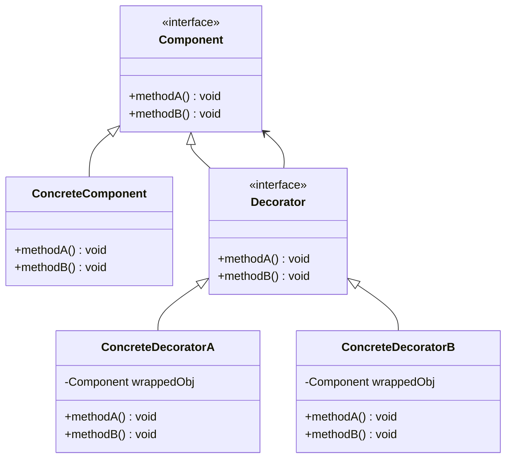
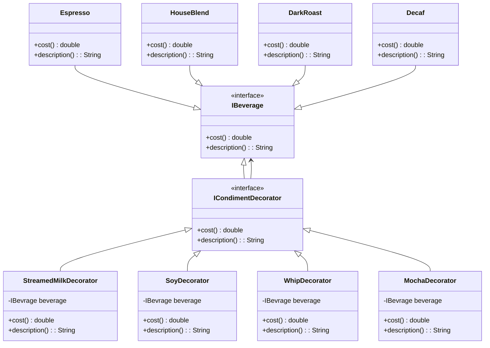

# Decorator pattern

## Definition

```text
The decorator pattern attaches additional responsibilities to an object dynamically.
Decorators provide a flexible alternative to subclassing for extending functionality.
```

## UML Diagram



In this diagram:

* `Component`: Defines the interface for objects that can have responsibilities added to them dynamically.
* `ConcreteComponent`: Represents objects to which additional responsibilities can be added.
* `Decorator`: Maintains a reference to a Component object and defines an interface that conforms to Component's interface.
* `ConcreteDecoratorA` and `ConcreteDecoratorB`: Add responsibilities to the components.


The relationships are depicted as follows:

* `Component` is inherited by `ConcreteComponent` and `Decorator`.
* `Decorator` is inherited by concrete decorators `ConcreteDecoratorA` and `ConcreteDecoratorB`.
* `Decorator` has a `Component`

## Starbuzz Coffee example



In this example :
* `IBeverage` corresponds to the `Component` interface in the decorator pattern, and `ICondimentDecorator` to the `Decorator` interface.
* `Espresso`, `HouseBlend`, `DarkRoast` and `Decaf` are the `ConcreteCompenent`.
* `StreamedMilkDecorator`, `SoyDecorator`, `WhipDecorator` and `MochaDecorator` are the `ConcreteDecorator`.

The decorators add responsibilities to the components by adding value to the cost and adapting the description during the order.

## Pros

* Responds to the design principle : Classes should be open for extension, but closed for modification.
* You can extend an object’s behavior without making a new subclass.
* You can add or remove responsibilities from an object at runtime.
* You can combine several behaviors by wrapping an object into multiple decorators.
* Single Responsibility Principle. You can divide a monolithic class that implements many possible variants of behavior into several smaller classes.

## Cons

* It’s hard to remove a specific wrapper from the wrappers stack.
* It’s hard to implement a decorator in such a way that its behavior doesn’t depend on the order in the decorators stack.
* The initial configuration code of layers might look pretty ugly.
* Can add complexity to the code and add to many classes.
* Can make the code harder to read (if too many decorators for the same component)