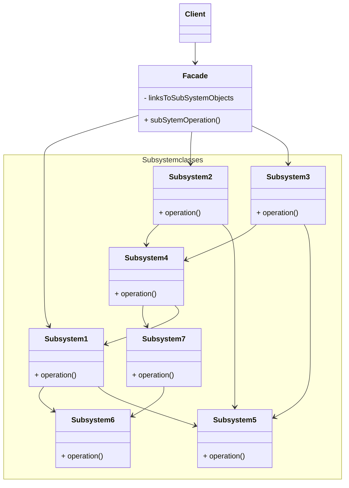
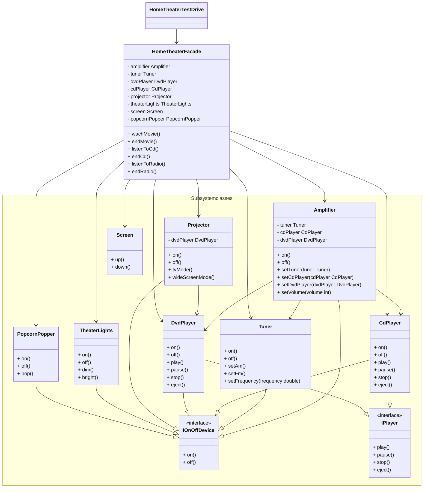

# Facade pattern

## Definition
```text
The facade pattern provides a unified interface to a set of interfaces in a subsystem.
Facade defines a higher-level interface that makes the subsystem easier to use.
```

## Diagram UML


* The `Facade` provides convenient access to a particular part of the subsystem’s functionality. 
It knows where to direct the `Client`’s request and how to operate all the moving parts.
* The `Complex Subsystem` consists of a lot of various objects. 
To make them all do something meaningful, you have to dive deep into the `subsystem`’s implementation details, 
such as initializing objects in the correct order and supplying them with data in the proper format.
`Subsystem` classes aren’t aware of the `Facade`’s existence. 
They operate within the system and work with each other directly.
* The `Client` uses the facade instead of calling the subsystem objects directly.

## Home theater example


In this example the `HomeTheaterFacade` provide an interface 
to simply launch a movie, listen to a cd or listen to the radio
and for each case another method to turn everything off.  
Before the creation of the facade, the `HomeTheaterTestDrive` 
had to interact with several elements of the subsystem to be able to watch a movie,
listen a cd or listen to the radio. After the creation of the cd, he just had to interact 
with the facade to do any of these things.
* `HomeTheaterFacade` is the `Facade`
* `Amplifier`,`Tuner`,`CdPlayer`,`DvdPlayer`,`Projector`,`TheaterLights`,`Screen`,`PopcornPopper`
are the different component in the subsystem.
* Note that the `HomeTheaterFacade` is are delegating the responsibility to the corresponding component in the subsystem

## Pros
* You can isolate your code from the complexity of a subsystem.
* Principle of least knowledge: the client only has one friend the `Facade`.

## Cons
* A facade can become a god object coupled to all classes of an app.