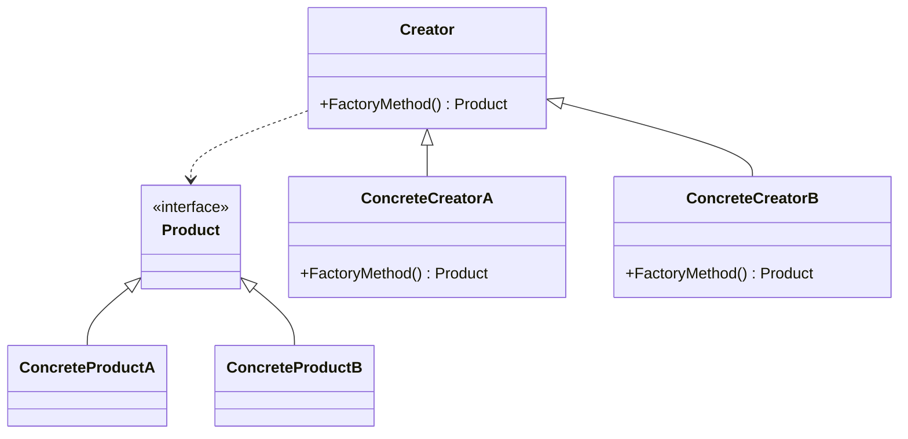
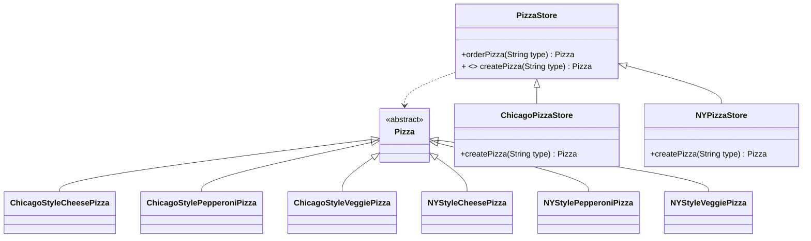

# Factory pattern

## Definition

```text
The factory methode pattern defines an interface for creating an object, but lets subclasses decide which class to instantiate.
Factory method lets a class defer instantiation to subclasses.
```

## Diagram UML


* The `Product` declares the interface, which is common to all objects that can be produced by the creator and its subclasses.
* `ConcreteProductA` and `ConcreteProductB` are different implementations of the product interface.
* The `Creator` class declares the factory method that returns new product objects. It’s important that the return type of this method matches the product interface.
You can declare the factory method as abstract to force all subclasses to implement their own versions of the method. As an alternative, the base factory method can return some default product type.
* `ConcreteCreatorA` and `ConcreteCreatorB` override the base factory method so it returns a different type of product.
Note that the factory method doesn’t have to create new instances all the time. It can also return existing objects from a cache, an object pool, or another source.

## Pizza store example



In this example :
* `PizzaStore` is the creator.
* `ChicagoPizzaStore` and `NYPizzaStore` are the `concrete creators`.
* `Pizza` is the `Product`.
* `ChicagoStyle` and `NYStyle` pizzas are the `concrete products`.
* `PizzaStore` let `ChicagoPizzaStore` and `NYPizzaStore` decide the subclass to instantiate, in this case for the first one ChicagoStyle pizzas and for the second NY style pizzas.

## Pros
* The factory method pattern is a way to respect the dependency inversion principle that says : `Depend upon abstractions. Do not depend upon concrete classes. It suggests that our high-level components should not depend on our low-level component; rather, they should 'both' depend on abstractions`.
* You avoid tight coupling between the creator and the concrete products.
* Single Responsibility Principle. You can move the product creation code into one place in the program, making the code easier to support.
* Open/Closed Principle. You can introduce new types of products into the program without breaking existing client code.

## Cons
*  The code may become more complicated since you need to introduce a lot of new subclasses to implement the pattern. The best case scenario is when you’re introducing the pattern into an existing hierarchy of creator classes.