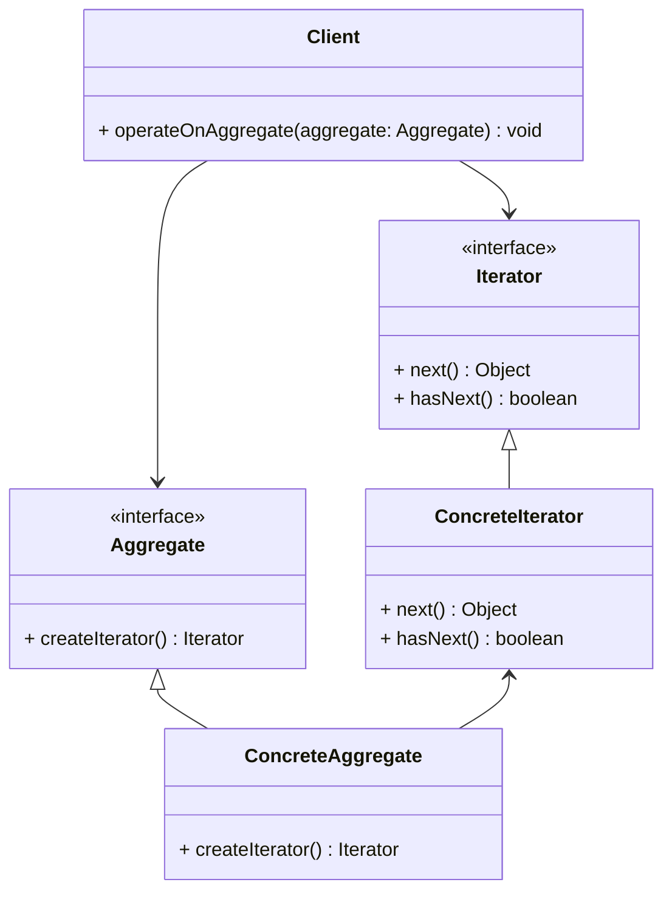
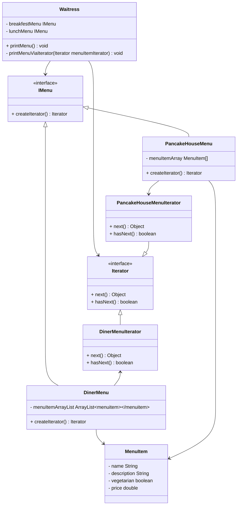

# Iterator pattern

## Definition

```text
The iterator pattern provides a way to access the elements of an aggregate object sequentially
without exposing is underlying representation.
```

## Diagram UML


* The `Iterator` interface declares the operations required for traversing an `Aggregate`.
* `Concrete Iterators` implement specific algorithms for traversing a collection.
  The iterator object should track the traversal progress on its own.
  This allows several iterators to traverse the same collection independently of each other.
* The `Aggregate` interface declares one or multiple methods for getting iterators compatible with the `aggregate`.
  Note that the return type of the methods must be declared as the `iterator` interface so that the `concrete aggregate`
  can return various kinds of `iterators`.
* `Concrete Aggregate` return new instances of a particular `concrete iterator` class each time the client requests one. 
  You might be wondering, where’s the rest of the `aggregate`’s code? Don’t worry, it should be in the same class.
  It’s just that these details aren’t crucial to the actual pattern, so we’re omitting them.
* The `Client` works with both `aggreagates` and `iterators` via their interfaces. 
  This way the client isn’t coupled to concrete classes, 
  allowing you to use various collections and iterators with the same client code.
  Typically, `clients` don’t create `iterators` on their own, but instead get them from `aggregate`. 
  Yet, in certain cases, the `client` can create one directly; for example, 
  when the `client` defines its own special `iterator`.

## Objectville diner example


 In this example :
* `IMenu` is the `Aggregate`.
* `Waitress` is the `client`.
* `DinerMenu` and `PancakeHouseMenu` are the `ConcreteAggregate`.
  They have a collection of MenuItem and implements the method responsible to create the appropriate `Concrete Iterator`
* `DinerMenuIterator` and `PancakeHouseMenuIterator` are the `ConcreteIterator`. 
  The first one iterate on an `ArrayList`. The second on an `Array`.
* The `Waitress` used the iterator without the knowledge about how the `Collection` is implemented.
  In on case an `ArrayList` in the other case an `Array`. We have encapsulated the iteration.
* `Waitress` only needs to be concerned with `IMenus` and `Iterators`. 
  We've decoupled `Waitres` from the implementation of the menus. 
 It can iterate over any list of menu items without having to know about how the list of items is implemented.

In the implementation we crete an `Iterator` interface to redefine by han each iterator.
We could have used the `Java.util.Iterator` interface and the concrete `Iterator` in `ArrayList` for the `DinerMenu`.

## Pros

* Single Responsibility Principle. You can clean up the client code and the aggregates by extracting 
  bulky traversal algorithms into separate classes.
* Open/Closed Principle. You can implement new types of aggregates and iterators 
  and pass them to existing code without breaking anything.
* You can iterate over the same aggregate in parallel because each iterator object contains its own iteration state.
* For the same reason, you can delay an iteration and continue it when needed.
* Places the task of traversal on the iterator object, not on the aggregate, 
  which simplifies the aggregate interface and places rhe responsibility where it should be.

## Cons

* Applying the pattern can be an overkill if your app only works with simple aggregates.
* Using an iterator may be less efficient than going through elements of some specialized aggregates directly.
