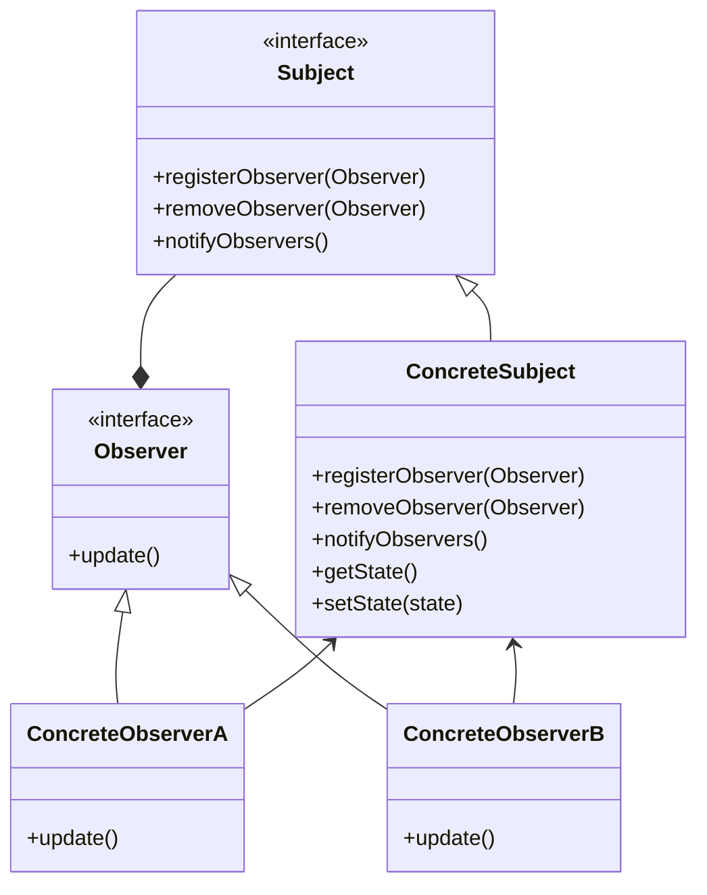
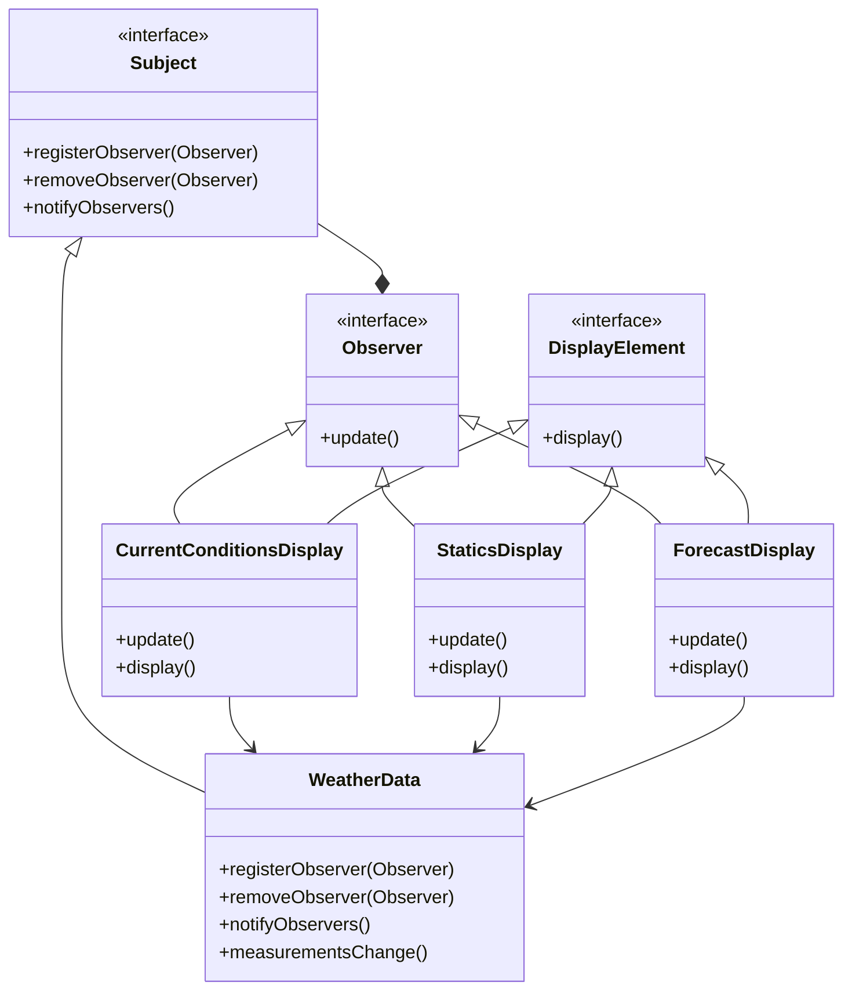

# Observer pattern

## Definition

```text
The observer pattern defines a one-to-many dependency between objects so that when one object changes state, 
all its dependents are notified and updated automatically.
```

## UML diagram 


In this diagram:

* `Subject`: Represents the subject being observed. It maintains a list of observers and provides methods to attach, detach, and notify observers.
* `ConcreteSubject`: A concrete implementation of the subject. It may have specific methods related to managing its state.
* `Observer`: Defines an interface for objects that should be notified of changes in the subject.
* `ConcreteObserverA`, `ConcreteObserverB`: Concrete implementations of observers. They implement the update method to react to changes in the subject.

## Weather station example



In this example :
* `Subject` and `Observer` are similar to the interfaces define in the observer pattern uml diagram
* `DisplayElement` is an addition in this example that is not related to the observer pattern, it was just cleaner to implement it this way in our example
* `WeatherData` implements the interface `Subject`. `WeatherData` get the different measurements, and when these measurements change it notify the observers `Observer` that are subscribed to it.
* `CurrentConditionsDisplay`, `StaticsDisplay` and `ForecastDisplay` want to display on their own way the weather measurements. That's why they both implements the interfaces `DisplayElement` and `Observer`, the fist one to display the element and the second to be able to subscribe to a WeatherData and be notified whenever the measurements change.

## Pros

* Responds to the design principle : Identify the aspects of yours application that vary and separate them from hat stays the same. With this pattern, you can vary the objects that are dependent on the state of the subject, without having to change this subject.
* Responds to the design principle : Program to an interface, not an implementation
* Responds to the design principle : Favor composition over inheritance
* Responds to the design principle : Strive for loosely coupled designs between objects that interact
* You can establish relations between objects at runtime.

## Cons

*  Subscribers are notified in random order.