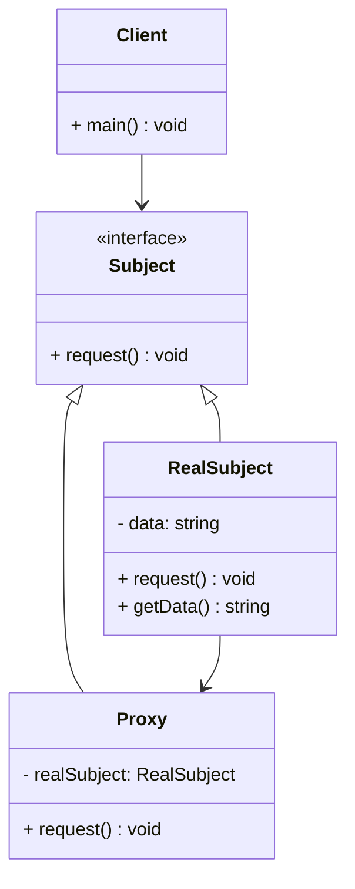
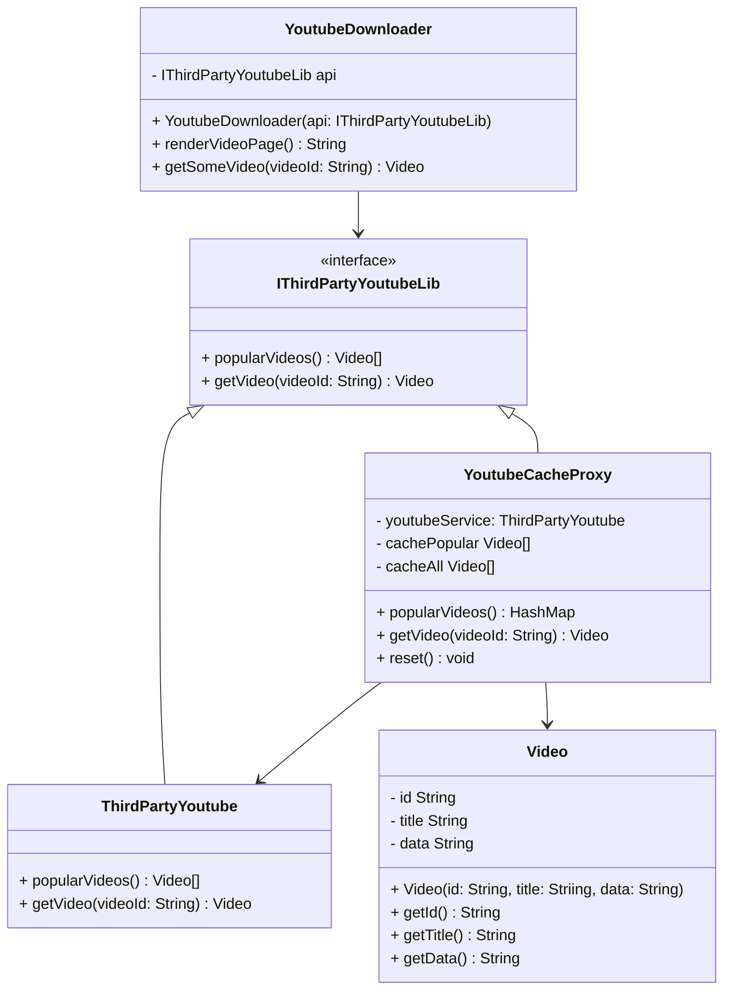

# Proxy pattern

## Definition

```text
The proxy pattern provides a surrogate or placeholder for another object to control access to it.
```

## Diagram UML



* The `Subject` interface declares the interface of the `Subject`. 
  The proxy must follow this interface to be able to disguise itself as a `subject` object.
* The `RealSubject` is a class that provides some useful business logic.
* The `Proxy` class has a reference field that points to a `RealSubject` object. 
  After the proxy finishes its processing (e.g., lazy initialization, logging, access control, caching, etc.),
  it passes the request to the `RealSubject` object.
  Usually, `proxies` manage the full lifecycle of their `RealSubject` objects.
* The `Client` should work with both `subjects` and `proxies` via the same interface. 
  This way you can pass a `proxy` into any code that expects a `subject` object.

## Example caching youtube vide


In this example :
* The library provides us with the video downloading class. 
  However, it’s very inefficient. If the client application requests the same video multiple times, 
  the library just downloads it over and over, instead of caching and reusing the first downloaded file.
* The proxy class implements the same interface as the original downloader and delegates it all the work. 
  However, it keeps track of the downloaded files and 
  returns the cached result when the app requests the same video multiple times.

## Pros

* You can control the service object without clients knowing about it.
* You can manage the lifecycle of the service object when clients don’t care about it.
* The proxy works even if the service object isn’t ready or is not available.
* Open/Closed Principle. You can introduce new proxies without changing the service or clients.

## Cons

* The code may become more complicated since you need to introduce a lot of new classes.
* The response from the service might get delayed.