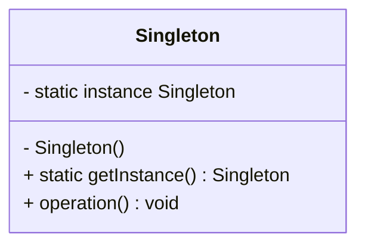
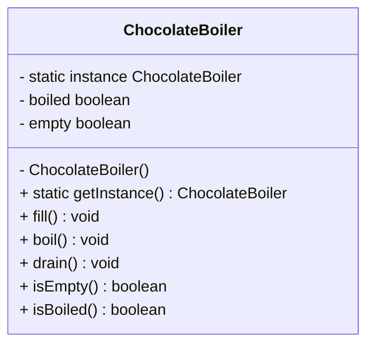

# Singleton pattern

## Definition

```text
The singleton pattern ensures a class has only one instance, and provides a global point of access to it.
```

## UML diagram



* The `Singleton` class declares the static method getInstance that returns the same instance of its own class.
* The `Singleton`’s constructor should be hidden from the client code. Calling the getInstance method should be the only way of getting the `Singleton` object.

## Chocolate boiler example



In this example we have several controller in a chocolate factory for one boiler. 
We want to have only one instance of the boiler in our application so each controller know the state and control the boiler correctly.

In the implementation, you will see several class of ChocolateBoiler, that's different technique to implement the singleton pattern correctly in java.
Regarding the context, you choose the one the most adapt to your situation.


`ChocolateBoiler` will be problematic with multi-thread, if two threads launch before the instance has been created, we will have two instances of the boiler.
Or we only want one. We should avoid this implementation and consider each application multi-threads. So use only one of the following technique:
* `SynchronizedChocolateBoiler` By adding the synchronized keyword to getInstance(); we force every thread to wait its turn before it can enter the method. 
That is, no two threads may enter the method at the same time. Use this method if the getInstance() method isn't causing substantial overhead for your application.
Synchronizing getInstance() is straightforward and effective. Keep in mind if in a high traffic part of your code begins using getInstance(), 
you could decrease the performance by a factor of 100.
* `EagerlyChocolateBoiler` we  create the instance in a static initializer, it's guaranteed thread safe. 
Use this method if your application always create and uses an instance of the `Singleton` 
or when to overhead if creation and runtine aspect of the `Singleton` are not onerous.
* `DoubleCheckedChocolateBoiler` with double-checked, we first check to see if an instance is created and if not, THEN we synchronize.
This way we only synchronize the first time through. If performance is an issue in your use of `getInstance()` method then this method
of implementing the `Singleton` can drastically reduce the overhead.

In this example since performance is not an issue and in every case we will instance the ChocolateBoiler, we should use
the first method or the second. The third one could be a bit overkill.