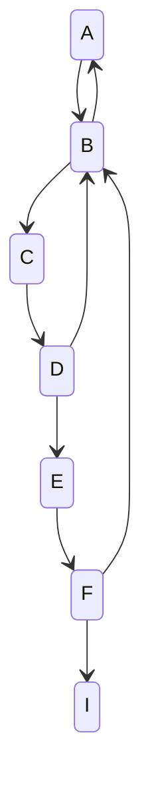
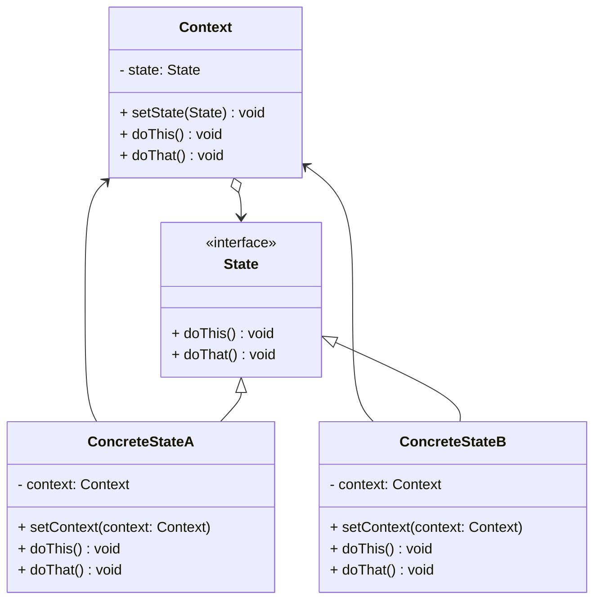
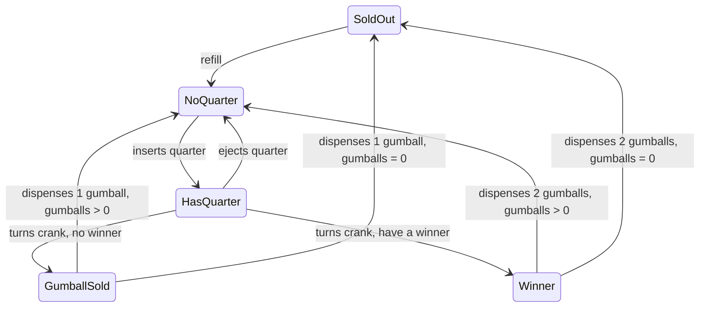
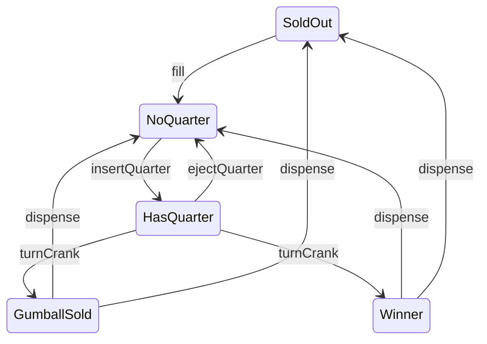
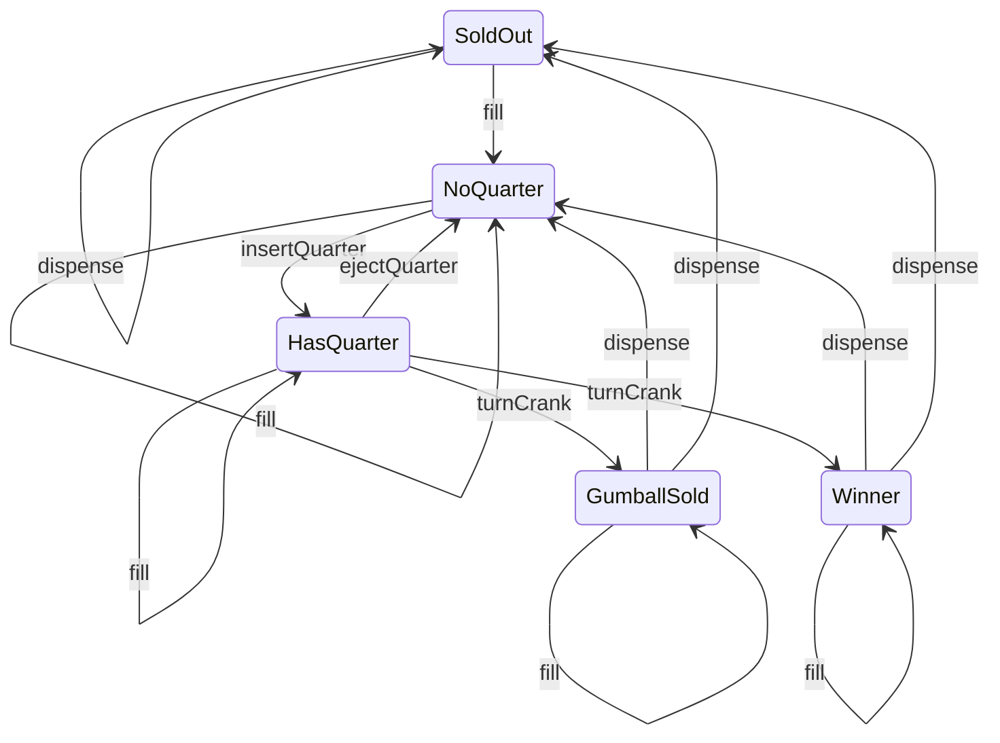
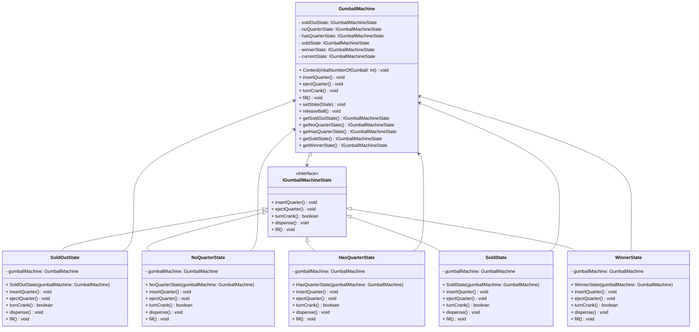

# State pattern

## Definition

```text
The state pattern allow an object to alter its behavior when its internal state changes.
The object will appear to change its class.
```

## State diagram



Example of a state machine representation, we have the different state A to I 
and the arrows represent the transition from a state to another.

## Diagram UML



* `Context` stores a reference to one of the `concrete state` objects and delegates to it all state-specific work. 
  The `context` communicates with the `state` object via the `state` interface. 
  The `context` exposes a setter for passing it a new `state` object.
* The `State` interface declares the state-specific methods. 
  These methods should make sense for all concrete states because you don’t want some of your `states` to have useless 
  methods that will never be called.
* `Concrete States` provide their own implementations for the state-specific methods. 
  To avoid duplication of similar code across multiple `states`, 
  you may provide intermediate abstract classes that encapsulate some common behavior.
  `State` objects may store a backreference to the `context` object. 
  Through this reference, the `state` can fetch any required info from the `context` object, 
  as well as initiate `state` transitions.
* Both `context` and `concrete states` can set the next `state` of the `context`
  and perform the actual `state` transition by replacing the `state` object linked to the context.

## Gumball machine example

We model a gumball machine that has different state and apply in your implementation the state pattern.

### State diagram

First the state diagram with a phrase to qualify each transition



I redraw this diagram and I named the transition with methods name



We have 5 different state in our machine : `SoldOut`, `NoQuarter`, `HasQuarter`, `GumballSold`, `Winner`.
And 5 transitions : `fill`, `insertQuarter`, `ejectQuarter`, `turnCrank`, `dispense`
To be complete we should define for each state what will be the next state when applying any of this transition.
Because we have to manage every state/transition case.

Without the state pattern knowledge we could do that by having if/else or switch 
applies in the gumball machine for each transition over each state.
But we can agree that implementation will be complicated to evolve and to maintain.

That's why the state pattern is for, we are going to encapsulate what changes 
aka how each transition works regarding the state.

We don't represent it on the above diagram to simplify the reading, 
here the diagram with all the state/transition represented :




Here you can see a lit bit more the complexity under this quite simple gumball machine.

### Class diagram



In this example
* `GumballMachine` is the `Context`. For each transition we delegate tho the `IGumballMachineState` states the mission
  to manage it and if necessary to change the currentState of the `GumballMachine`.
* `IGumballMachineState` is the `State` interface, it defines each of the methods mapped 
  on the transition that we have identified.
* `SoldOutState`, `NoQuarterState`, `HasQuarterState`, `SoldState`, `WinnerState` are the `ConcreteStates`.
  Each of the state manage the transition regarding its case only 
  and not knowing other states that the ones, they transition to. 
  They set the next state of the `GumballMachine` when it's necessary.

## Pros

* Single Responsibility Principle. Organize the code related to particular states into separate classes.
* Open/Closed Principle. Introduce new states without changing existing state classes or the context.
* Simplify the code of the context by eliminating bulky state machine conditionals.

## Cons

* Applying the pattern can be overkill if a state machine has only a few states or rarely changes.
