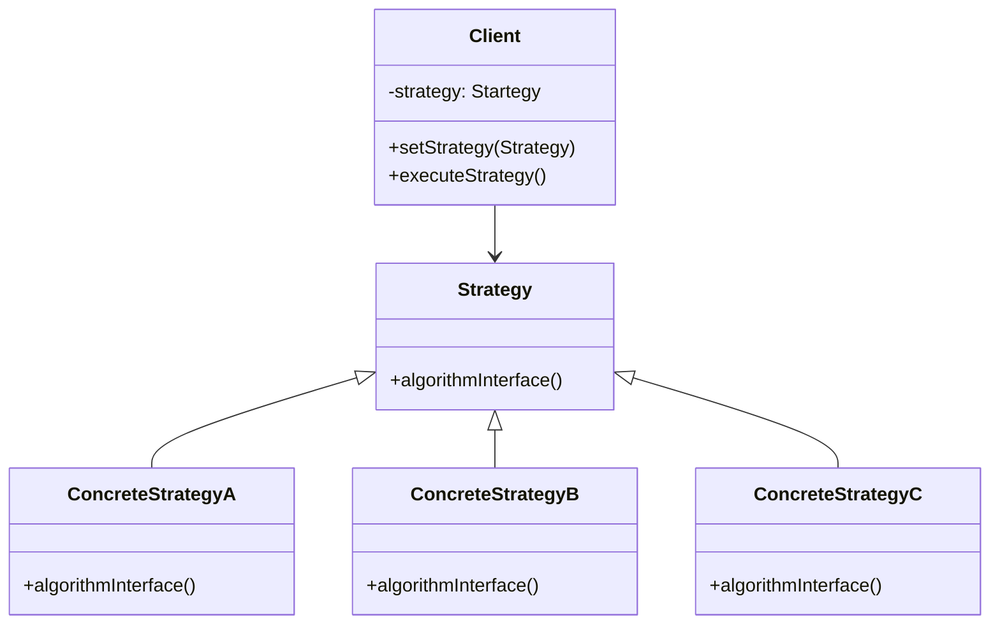
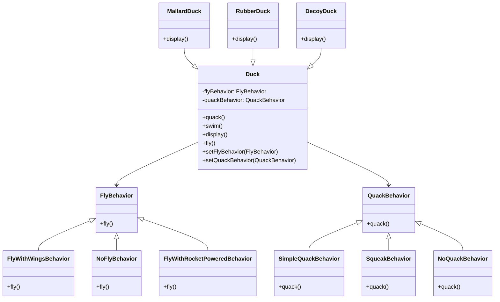

# Strategy pattern

## Definition

The strategy pattern defines a family of algorithms, encapsulates each one, and makes them interchangeable.
Strategy lets the algorithm vary independently from clients that use it.

## UML Diagram



## Duck example



In the example, we encapsulate the fly behavior and the quack behavior. Think of them as family of algorithm.
In both of these family, the algorithms are interchangeable. We can change the NoFlyBehavior to the FlyWithRocketPower 
or with FlyWithWingsBehavior.
Each behavior can vary without having to change the duck class or one of his subclass.

Now you can read the definition again :

```text
The strategy pattern defines a family of algorithms, encapsulates each one, and makes them interchangeable.
Strategy lets the algorithm vary independently from clients that use it.
```

## Pros

* Responds to the design principle : Identify the aspects of yours application that vary and separate them from hat stays the same.
* Responds to the design principle : Program to an interface, not an implementation
* Responds to the design principle : Favor composition over inheritance
* Offer the possibility to change behavior at run time
* Avoid duplicate code in subclass using the same algorithm
* Respect the Open/Closed principles :  You can introduce new strategies without having to change the context.

## Cons

* If you only have a couple of algorithms and they rarely change, there’s no real reason to overcomplicate the program with new classes and interfaces that come along with the pattern.
* Clients must be aware of the differences between strategies to be able to select a proper one.
*  A lot of modern programming languages have functional type support that lets you implement different versions of an algorithm inside a set of anonymous functions. Then you could use these functions exactly as you’d have used the strategy objects, but without bloating your code with extra classes and interfaces.