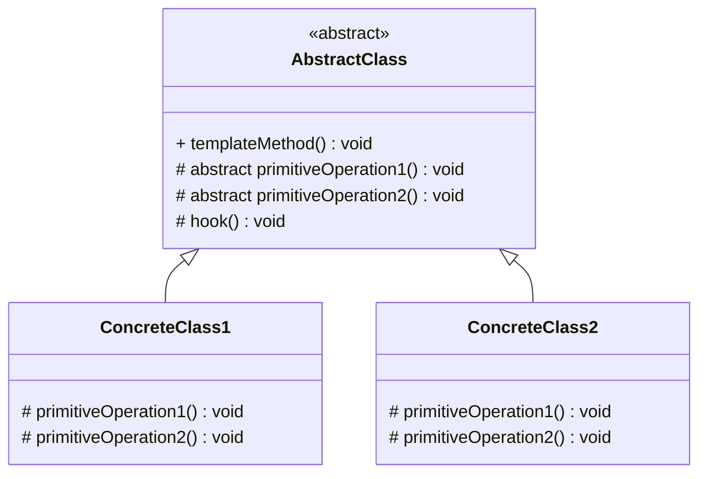
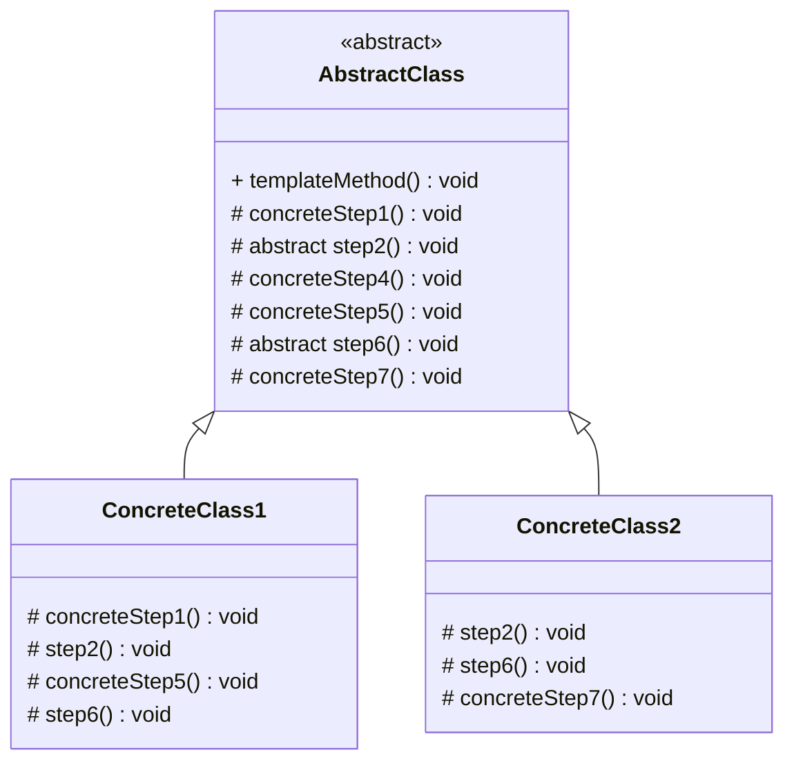
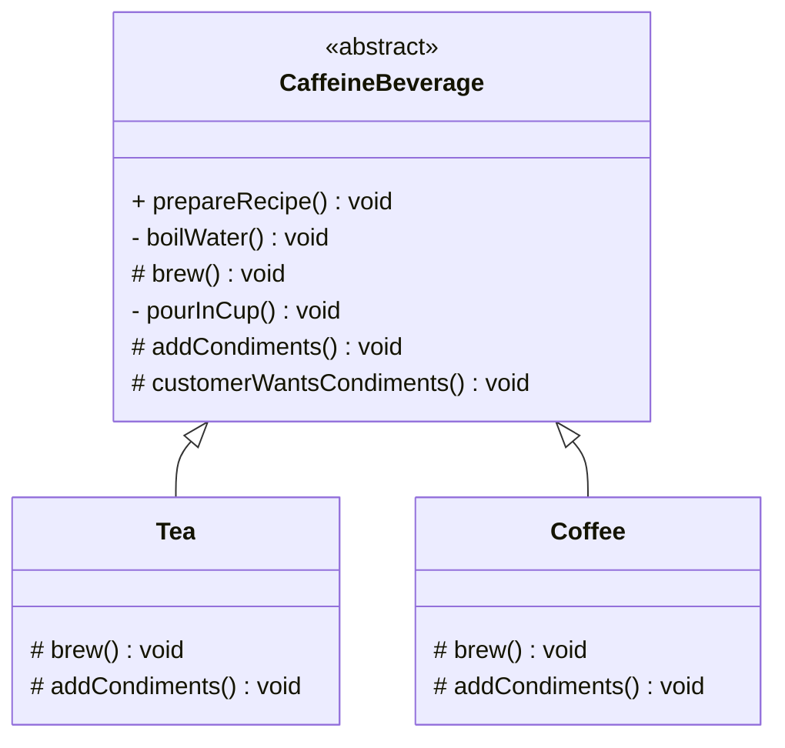

# Template method pattern

## Definition

```text
The template method pattern defines the skeleton of an algorithm in a method, deferring some steps to subclasses.
Template method lets subclasses redefine certain steps of an algorithm without changing the algorithm's structure.
```

## Diagram UML


* The `Abstract Class` declares methods that act as steps of an algorithm, 
as well as the actual template method which calls these methods in a specific order.
* The template method make use of the `templateMethod` to implant an algorithm
It is decoupled from the actual implementation of these operations. `templateMethod` are abstract methods
* They may be many `ConcreteClass`, each implementing the full set of operations required by the template method.
* You can `hooks` that are concrete method in the abstract class that do nothing, but are called in precise place in the
  `template method`. Subclasses are free to overwrite these but don't have too.

### Other version of the template method

FYI: I saw during my research another template method pattern definition that defines in the `AbstractClass`
some abstract method like define in the explanation above, but also allows the user to change the step with default behavior.
All the steps in the templateMethod can be rewritten by the subclasses. To be more explicit, I create modify the diagram see below :



* The `Abstract Class` declares methods that act as steps of an algorithm, as well as the actual template method 
which calls these methods in a specific order. The steps may either be declared abstract or have some default implementation.
* `Concrete Classes` can override all the steps, but not the template method itself.

The definition associate to this diagram is :
```text
Template Method is a behavioral design pattern that defines the skeleton of an algorithm in the superclass
but lets subclasses override specific steps of the algorithm without changing its structure.
```

The `steps` that are concrete in the `abstract class` can be compare to the `hook` in the first diagram.
But `hooks` are define to do 'nothing', while `concrete steps` define a default behavior in the `abstract class`.

## Starbuzz coffee example

Our example implements the first version of this pattern (that seems to be the definition provides by the gang of four)



In this example the way to prepare a recipe is to :
1. Boil water
2. Brew an element
3. Pour in cup the beverage
4. Add condiment to it  
The steps 1 and 3 are the same for all caffeine beverage, that are steps the subclass can't overwrite.  
The steps 2 and 4 are specific to each beverage, these are the `primitiveOperation` that the subclass have
to implement.

If the hook `customerWantsCondiments` we can decide to had condiments or not (to call the step 4)
regarding the customer choice

## Pros

* You can pull the duplicate code into a superclass. And maximizes reuse among subclasses
* Protects the algorithm. It lives in one place, code changes only to be made here.
* Concentrates the knowledge about the algorithm and relies on subclasses to provide complete implementations.

## Cons

* Some clients may be limited by the provided skeleton of an algorithm.
* Template methods tend to be harder to maintain the more steps they have.